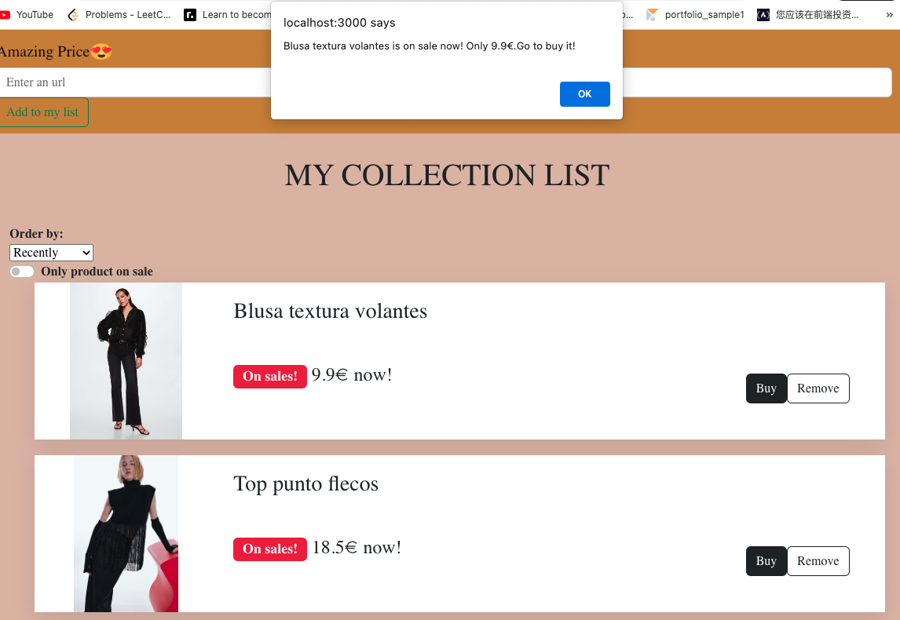

# Price_tracker
price tracker that track online store's products price and notify user when the price drops

# Usage
Track the of given url product, if the product drop the price, then send a notification to the user.
Also you can use for the collect products from different sites

# Technologies used
- React JS
- Bootstrap
- Express JS
- MySQL
- - Node JS / Nodemon
NPM package rss-parser for reading RSS feeds

## DATABASE ##

The database I am using is called: paygapinfo
It has one table: eustat_data

1. - Open MySQL in your terminal by running `mysql -u root -p`

2. - Create a new database called "paygapinfo": `CREATE DATABASE paygapinfo`

3. - Create an `.env` file in the project folder, and write your MySQL authentication information in it. For example:
```bash
DB_HOST=localhost
DB_USER=root
DB_NAME=paygapinfo
DB_PASS=(your password)
```
4. - Go to the project folder and run `npm run migrate`.

5. - In your MySQL terminal window, run `USE paygapinfo;` then `SHOW TABLES;`. Your database should contain 1 table: `eustat_data`

6. - You can run `DESCRIBE eustat_data;` to check that the table has been set up correctly.

## Example ##


